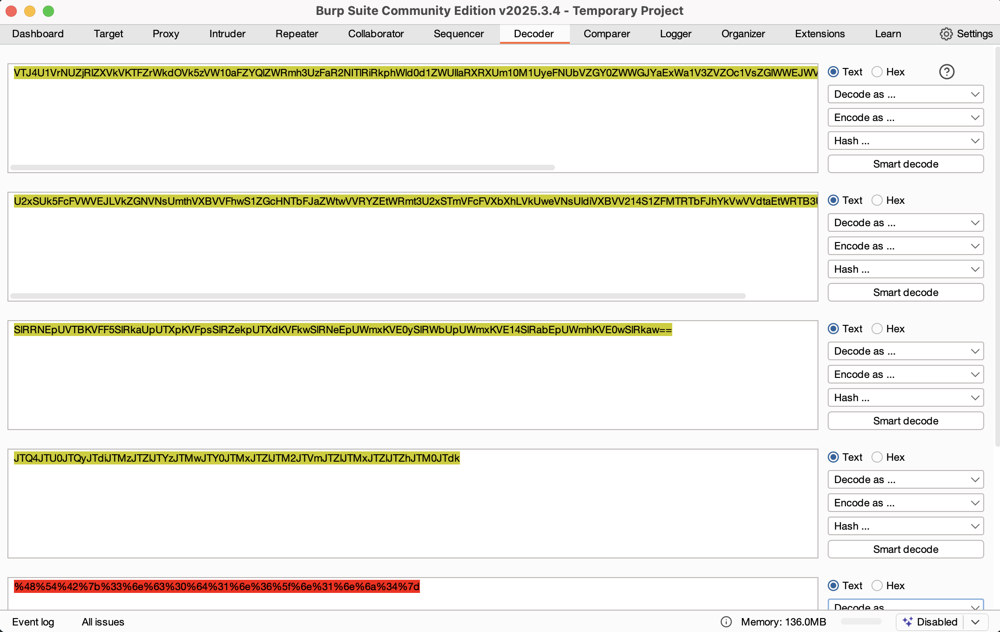

# 🧩 HTB Academy – Using Web Proxies: Encoding/Decoding

📚 **Module:** [Using Web Proxies Encoding/Decoding](https://academy.hackthebox.com/module/110/section/1052)  
🛡️ **Path:** Bug Bounty Hunter  
🗓️ **Date Solved:** 2025-05-19  
🔧 **Skills Demonstrated:** Multi-layer encoding recognition, Base64/URL decoding, use of Burp Suite, CLI efficiency, analytical problem-solving

---

## 🧠 Challenge Overview

This HTB Academy module involves decoding a deeply encoded string using web proxy tools and pattern recognition. The goal is to decode step-by-step and recognize encoding techniques often used in bug bounty or CTF scenarios.

The challenge emphasizes:
- Identifying multiple encoding layers
- Using built-in decoding tools (Burp Suite Decoder)
- Optionally using CyberChef to test and chain decoding operations

---

### 🔐 Input String

**Input:**
VTJ4U1VrNUZjRlZXVkVKTFZrWkdOVk5zVW10aFZYQlZWRmh3UzFaR2NITlRiRkphWld0d1ZWUllaRXRXUm10M1UyeFNUbVZGY0ZWWGJYaExWa1V3ZVZOc1VsZGlWWEJWVjIxNFMxWkZNVFJUYkZKaFlrVndWVmR0YUV0V1JUQjNVMnhTYTJGM1BUMD0=

---

## 🔍 Decoding Steps

### Step 1 – Base64 Decode ×4
- Noted the padded `==` ending (indicator of Base64)
- Decoded recursively until readable string appeared

Result after decoding:

JTQ4JTU0JTQyJTdiJTMz...

### Step 2 – URL Decode
- Recognized the format `JTxx` → corresponds to `%xx` in URL encoding
- Decoded to plain ASCII using Burp Suite Decoder and CyberChef

---

## ✅ Final Output

Successfully revealed a flag in the format: `HTB{*****}`  
(The full flag has been omitted to avoid spoilers.)

---

## 💡 Key Takeaways

- **Layered encodings** are common in web challenges and must be peeled back systematically.
- Tools like **CyberChef** are highly effective for chaining decoding operations.
- Recognizing visual encoding cues (like `=`, `%`, or `JT`) is essential for quick analysis.

---

🔒 *Challenge completed under HTB Academy guidelines.*  
✍️ *Write-up by [@emi-8](https://github.com/emi-8)*