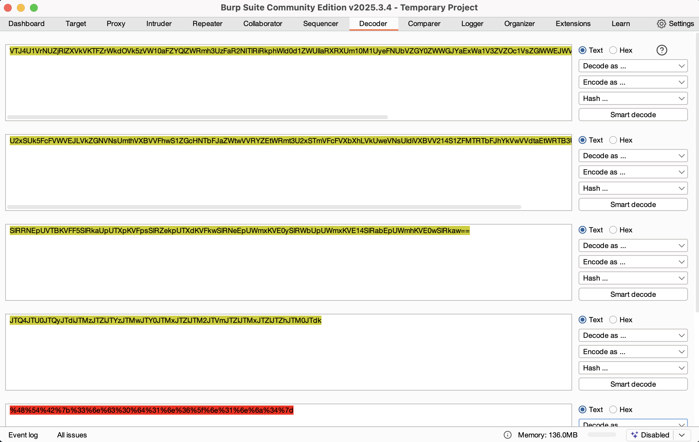

# 🧩 HTB Academy – Using Web Proxies: Encoding/Decoding

📚 **Module:** [Using Web Proxies Encoding/Decoding](https://academy.hackthebox.com/module/110/section/1052)  
🛡️ **Path:** Bug Bounty Hunter  
🗓️ **Date Solved:** 2025-05-19

---

## 🧠 Challenge Overview
The goal is to recognize the encoding patterns and decode it step-by-step using Burp Suite Decoder, as demonstrated in the module.
(You could also use tools like CyberChef to experiment with alternate decoding paths.)

**Input:**
VTJ4U1VrNUZjRlZXVkVKTFZrWkdOVk5zVW10aFZYQlZWRmh3UzFaR2NITlRiRkphWld0d1ZWUllaRXRXUm10M1UyeFNUbVZGY0ZWWGJYaExWa1V3ZVZOc1VsZGlWWEJWVjIxNFMxWkZNVFJUYkZKaFlrVndWVmR0YUV0V1JUQjNVMnhTYTJGM1BUMD0=

---

## 🔍 Decoding Process

### Step 1 – Base64 Decode ×4
- Observed the `=` and `==` endings to detect multiple Base64 layers.
- Decoded until output changed to this:

JTQ4JTU0JTQyJTdiJTMz...

### Step 2 – URL Decode ×1
- `JTxx` → `%xx` → ASCII string

---

## 🏁 Final Output
> ✅ A string in the format of `HTB{*****}` was successfully revealed.

> _(Intentionally hidden to avoid spoilers for others. 🫣)_  
> _Flag visible only to Supervisor Kiki and the operator 🐾_

---

## 💡 Lessons Learned
- Layered encodings are common in bug bounty and CTFs — train your eyes for patterns!
- CyberChef is an ideal tool for chaining operations.
- Trust the hints: `=`, `%`, and `JTxx` are all clues.

---

## 🐾 Supervisor Log: Kiki’s Notes
- ✅ Watched the human type repeatedly.
- ✅ Yawned during step 3.
- ✅ Approved the final decode by sitting on the keyboard.

---

🧠 *Logged by: @emi-8*  
🔒 *Challenge completed ethically under HTB Academy guidelines.*